# yolov8-plane-ship-detection

基于 YOLOv8m 的遥感图像目标检测项目，检测舰船、飞机和机场跑道。

## 项目结构
yolov8-plane-ship-detection/               
├── data/                  
│   ├── images/                 
│   │   ├── train/                 
│   │   ├── val/                 
│   │   └── test/                 
│   └── labels/                 
│       ├── train/                 
│       ├── val/                 
│       └── test/                 
├── data.yaml               
├── models/                 
├── runs/                   
├── train.py               
├── combine_data.py               
├── predict.py             
└── README.md             

## Branches 1
仅使用NWPU_VHR10数据集训练模型，由于此数据集仅包含ship和plane，就只看这两个参数，其他类别的指数忽略。详细数据如下:
### 训练结果
#### 损失曲线
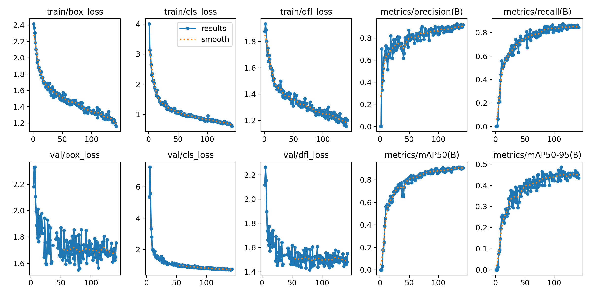

#### 各类别 PR 曲线
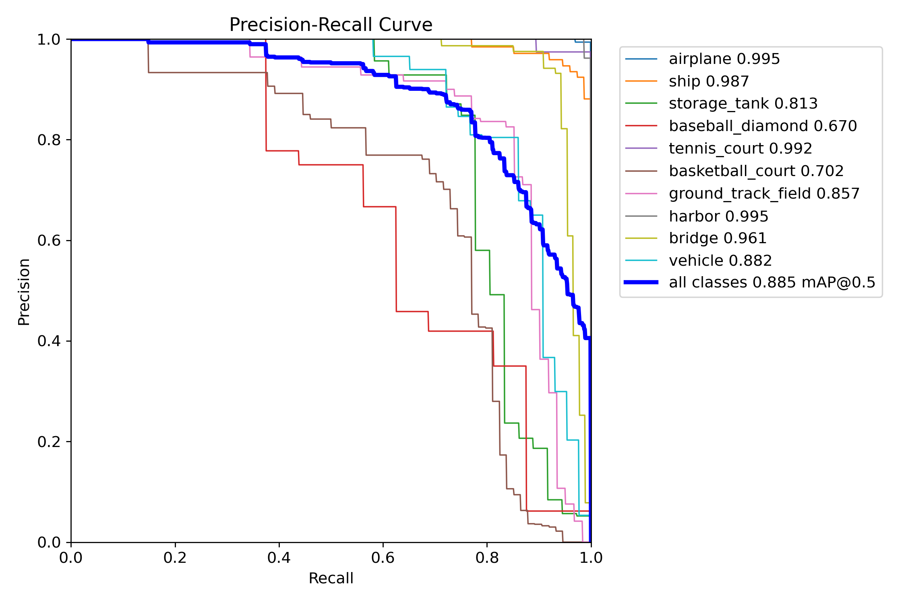

#### 混淆矩阵
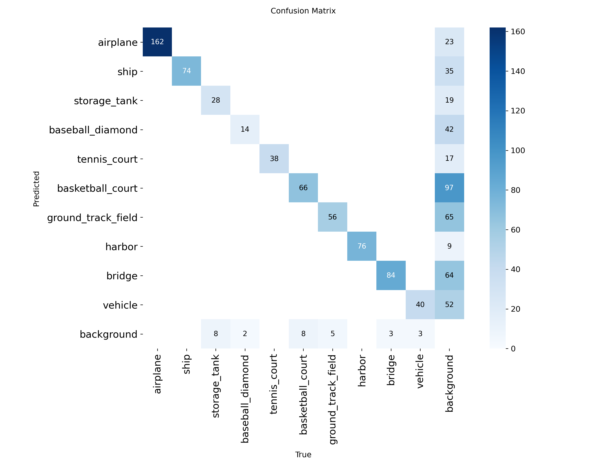

### 预测示例
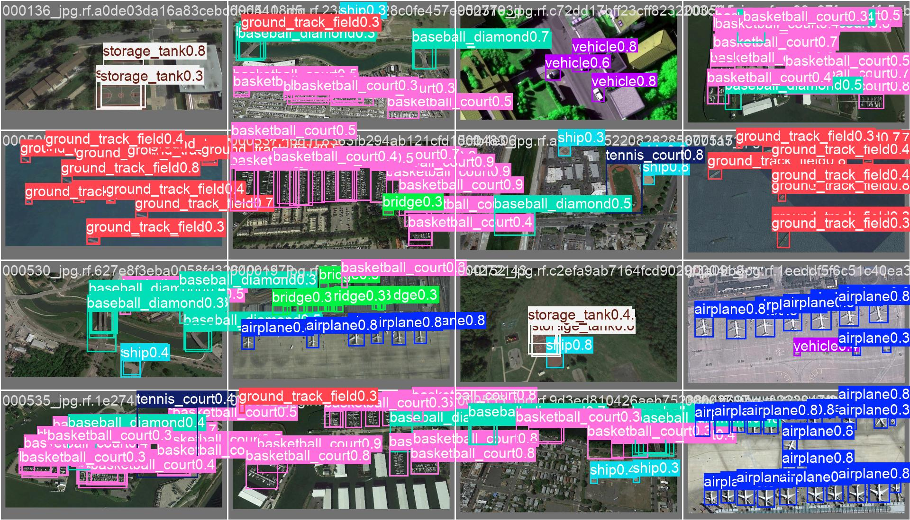

## Branches 2
Branches 1中plane的准确率已经够高了，尝试提升ship的准确率，考虑到HRSC 2016数据集仅包含ship，于是将HRSC数据集作为填充，和NWPU合并训练，但HRSC是xml格式旋转框标注，所以还需要转格式，格式转换的同时把不需要的类别也剔除了。详细数据如下:
### 训练结果
效果极差，plane准确率降低在意料之中，因为大量ship样本融入导致plane变成尾类数据，ship准确率降低可能是因为旋转框转换成水平框导致标注质量降低，标注框中引入大量背景。
#### 损失曲线
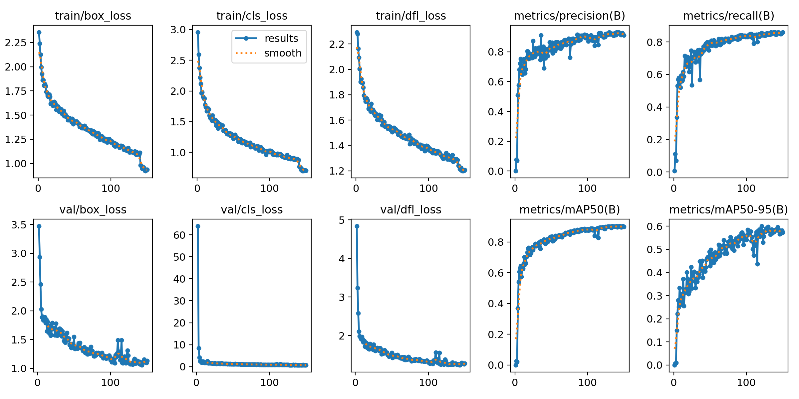

#### 各类别 PR 曲线
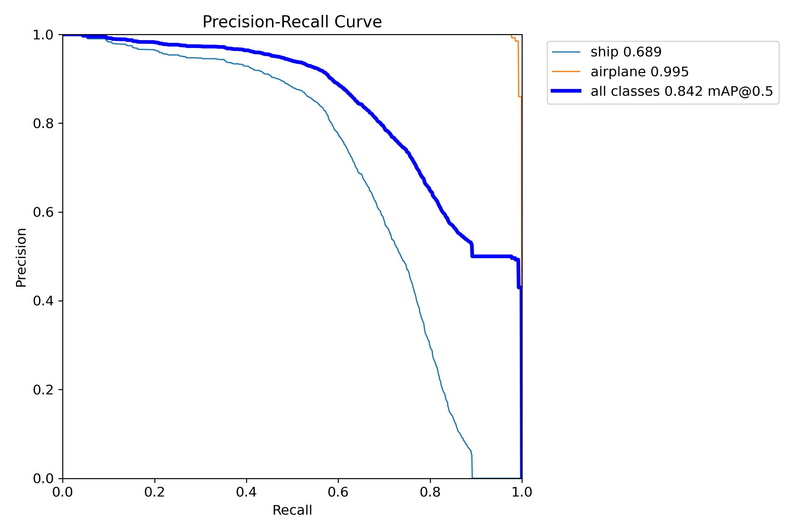

#### 混淆矩阵
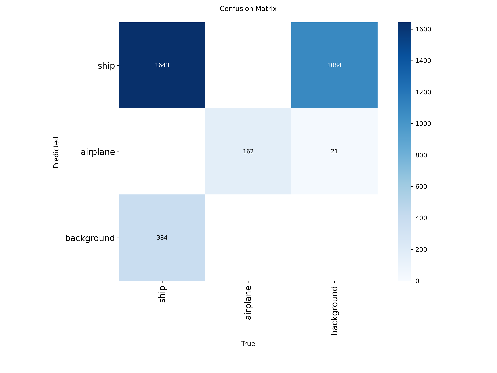

### 预测示例
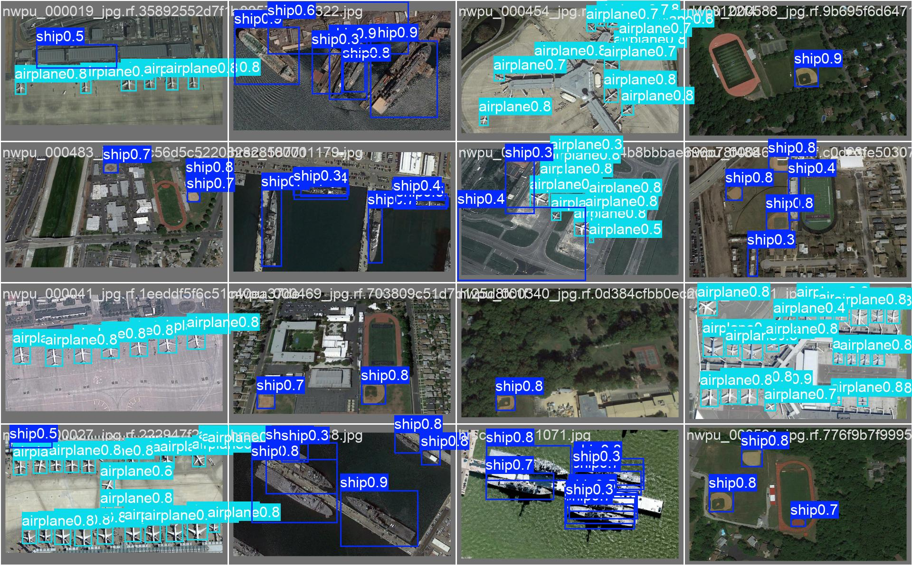

## Branches 3
Branches 1中plane的准确率已经够高了，尝试提升ship的准确率，考虑到HRSC 2016数据集仅包含ship，于是将HRSC数据集作为填充，和NWPU合并训练，但HRSC是xml格式旋转框标注，所以还需要转格式，格式转换的同时把不需要的类别也剔除了。详细数据如下:
### 训练结果
效果极差，plane准确率降低在意料之中，因为大量ship样本融入导致plane变成尾类数据，ship准确率降低可能是因为旋转框转换成水平框导致标注质量降低，标注框中引入大量背景。
#### 损失曲线
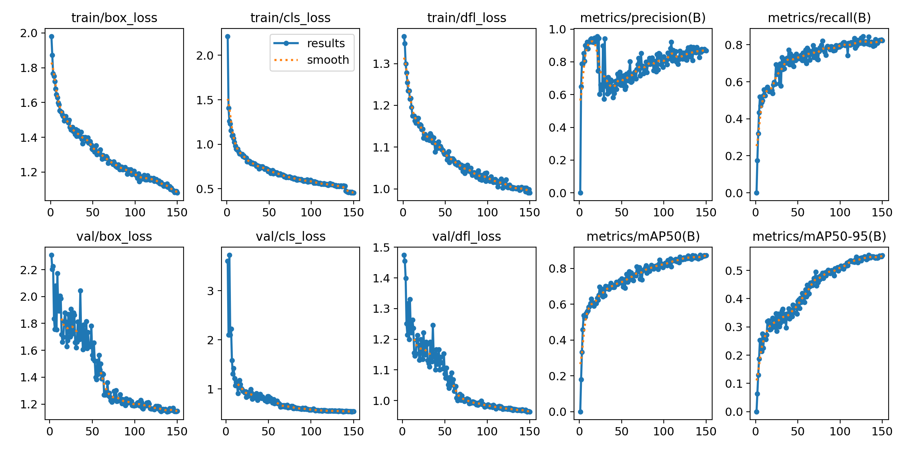

#### 各类别 PR 曲线
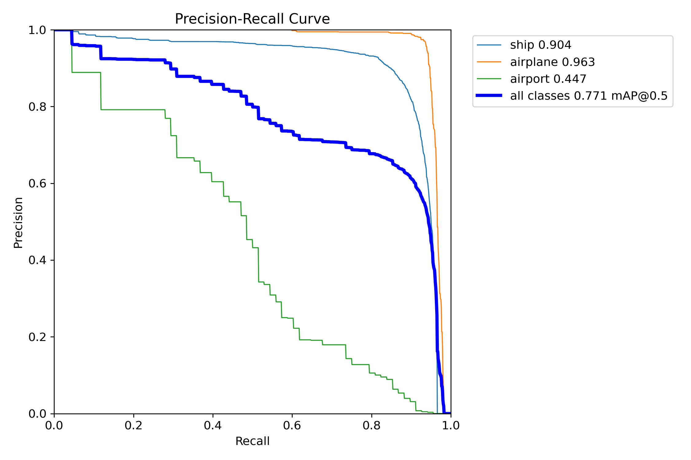

#### 混淆矩阵
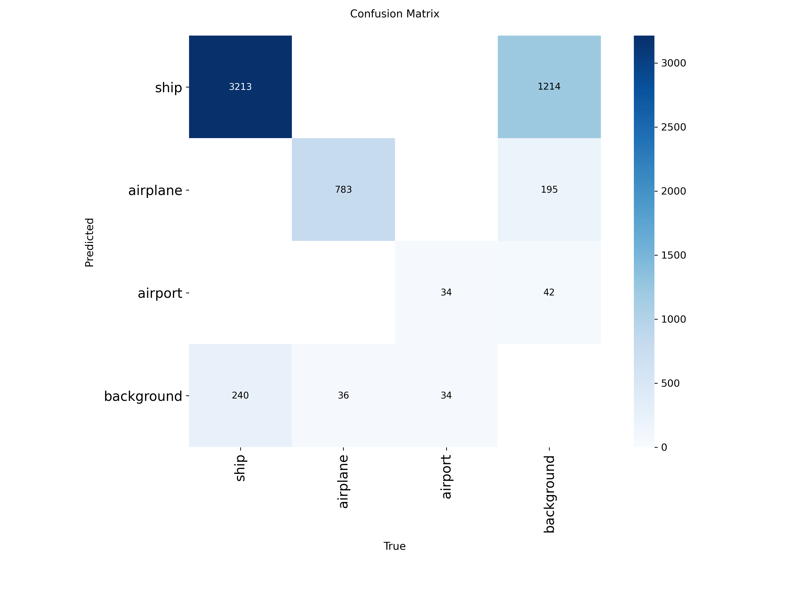

### 预测示例

